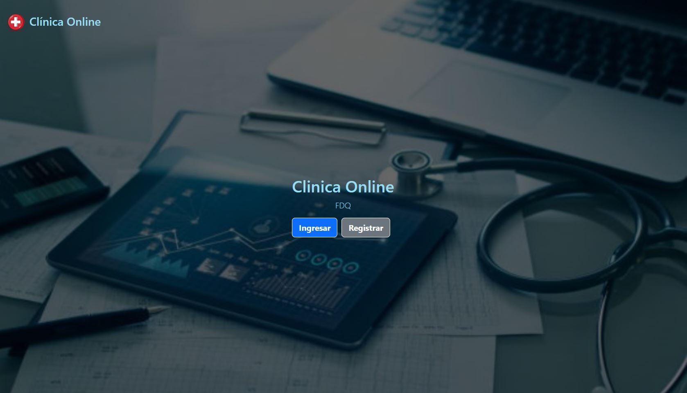
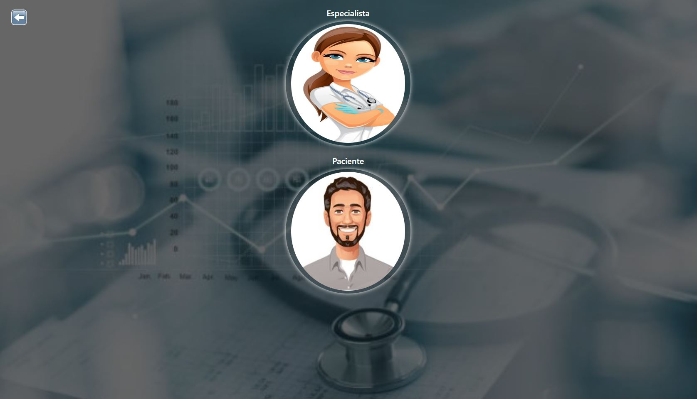
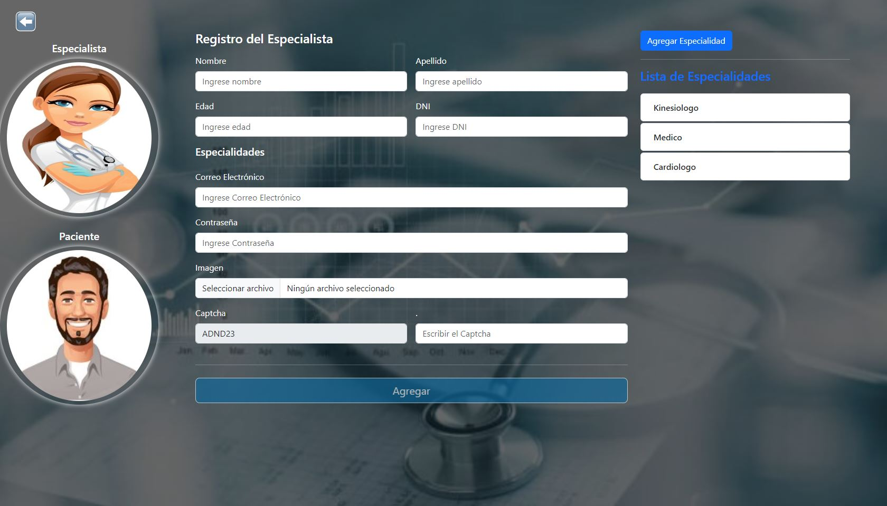
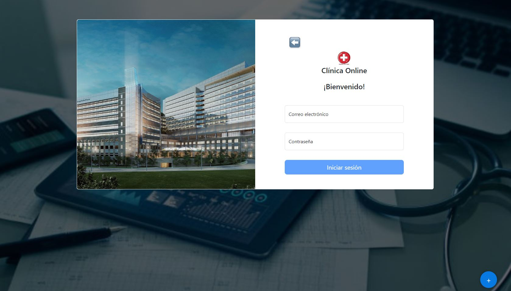
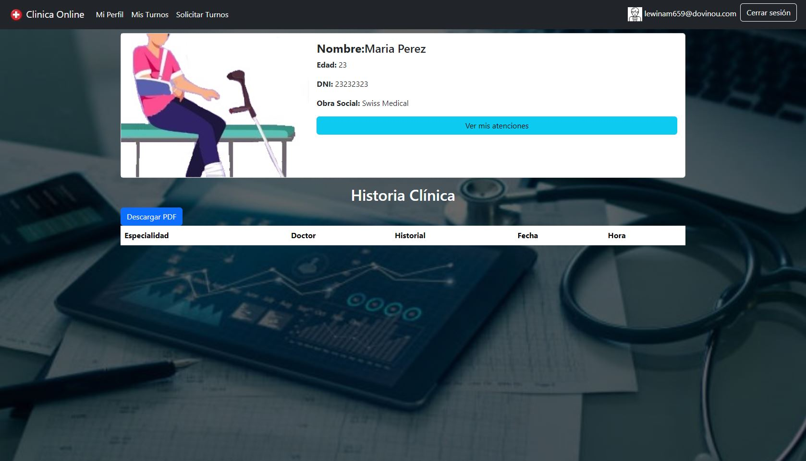
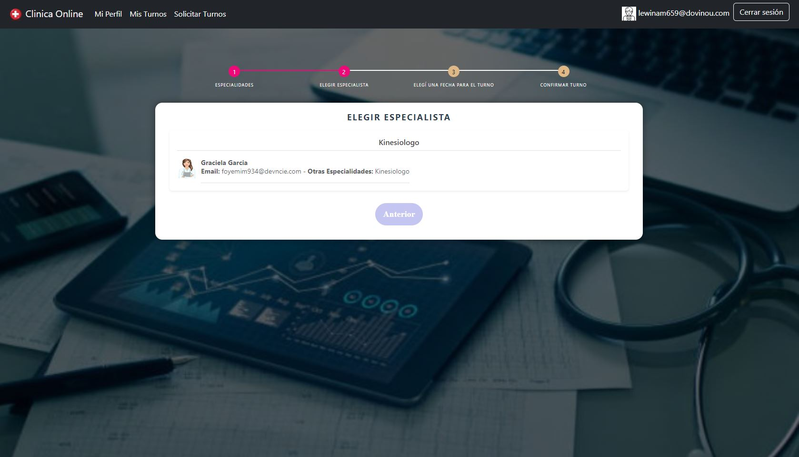

# :hospital: Clínica Online

La clínica online es un sistemas por el cual los usuarios (Administradores, Especialistas y Pacientes) 
pueden acceder a sacar turnos, ver sus horarios, visualizar el historial clínico, entre otras opciones.

[Clinica Online](https://clinicaonline-cdb52.web.app/auth/bienvenido)

## Pantallas de la aplicación

### :hospital: Página de bienvenida

### :hospital: Registro

En esta sección el usuario puede registrarse como paciente o especialista.

Luego de completar los datos les llegara un correo electrónico para completar la registración y acceder al sistema si es paciente, en el caso de ser especialista tendrá que esperar a que un administrador los habilite.

### :hospital: Login

Completando los datos los usuarios pueden acceder al sistema para realizar lo que tengan habilitado según su nivel.

Al acceder un paciente, por ejemplo, puede ver su historial.

### :hospital: Turnos

Los usuarios pueden sacar turnos de acuerdo a los especialistas que se encuentran habilitados en la clínica.

